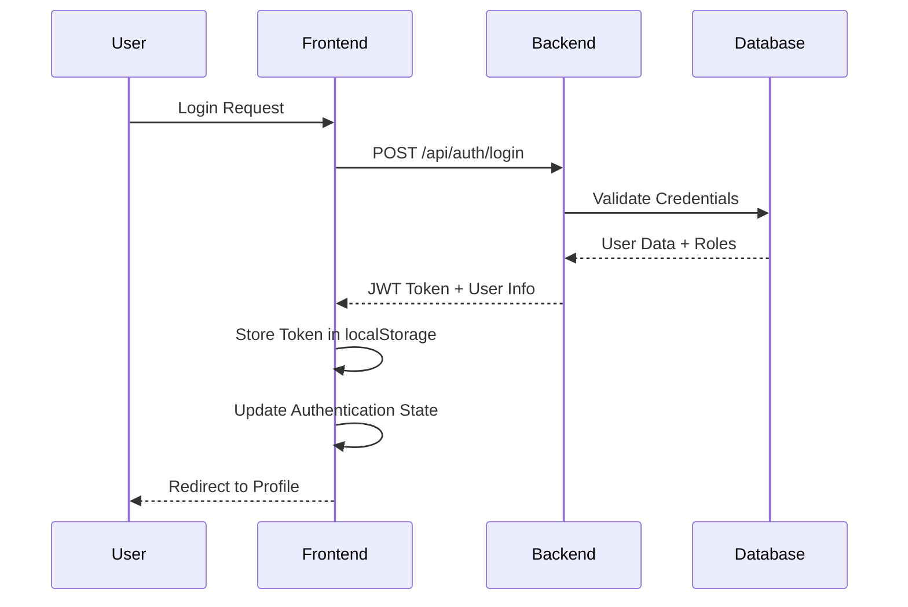

# SkillSnap: Enterprise Full-Stack Developer Portfolio Platform

[](https://github.com/aqpfarmer/SkillSnap)
[](https://dotnet.microsoft.com/)
[](https://blazor.net/)
[](LICENSE)

SkillSnap is a modern, enterprise-ready full-stack web application designed to showcase developer portfolios with comprehensive skill management, project tracking, and user administration capabilities. This project demonstrates advanced web development principles, security implementation, and scalable architecture patterns.

## 🎯 Project Overview

SkillSnap serves as a complete portfolio management platform where developers can showcase their skills, manage projects, and maintain professional profiles. The application features a robust role-based access control system, JWT authentication, and a modern component-based frontend architecture.

## ✨ Key Features

### 🔐 Authentication & Authorization
- **JWT Bearer Token Authentication** - Secure token-based authentication system
- **Role-Based Access Control (RBAC)** - Three-tier permission system:
  - **👤 User**: View-only access to portfolio data
  - **🛠️ Manager**: Create, edit, and delete projects and skills
  - **🔑 Admin**: Full system access including user management
- **ASP.NET Core Identity Integration** - Enterprise-grade user management
- **Automatic Role Assignment** - New users get User role by default
- **Admin User Seeding** - Pre-configured admin account for system setup

### 👥 User Management
- **User Registration & Login** - Secure account creation and authentication
- **Role-Based User Administration** - Complete user management system with role assignment
- **Smart Profile Images** - Automatic URL processing with Google image search support and cache-busting
- **Profile Dashboard** - Comprehensive user profile with token information and role display
- **Admin User Management Panel** - Full CRUD operations for user accounts with role management
- **Dynamic Role Assignment** - Real-time role updates (User/Manager/Admin) with proper permissions
- **User Portfolio Integration** - Automatic portfolio creation and management
- **Token Analysis** - JWT token inspection with expiration monitoring

### 📊 Portfolio Management
- **Skills Tracking** - Skill management with proficiency levels and user association
- **Project Showcase** - Project portfolio with descriptions, URLs, and user attribution
- **User Profiles** - Complete developer profiles with bio, smart image handling, and contact info
- **CRUD Operations** - Full create, read, update, delete functionality with proper authorization
- **Data Validation** - Form validation and error handling with Entity Framework tracking optimization
- **Smart Image Processing** - Automatic Google search URL extraction, cache-busting, and fallback handling
- **Role-Based Editing** - Users can edit their own portfolios, Admins can edit any portfolio

### 🎨 Modern UI/UX
- **Component-Based Architecture** - Reusable Razor components
- **Responsive Design** - Mobile-first responsive layout
- **Professional Styling** - Modern CSS with hover effects and animations
- **Role-Based Navigation** - Dynamic menu based on user permissions
- **Landing Page Routing** - Smart routing based on authentication state

## 🏗️ Architecture & Technology Stack

### Backend (.NET Core Web API)
```
🔧 Framework: ASP.NET Core 9.0
🗣️ Language: C# 12
🏛️ Architecture: MVC/API Controller Pattern
🔗 ORM: Entity Framework Core
🗄️ Database: SQLite with Code-First Migrations
🔐 Security: ASP.NET Core Identity + JWT Bearer
📚 Documentation: Swagger/OpenAPI Integration
🔄 CORS: Configured for cross-origin requests
```

### Frontend (Blazor WebAssembly)
```
⚡ Framework: Blazor WebAssembly (.NET 9)
🧩 Architecture: Component-Based SPA
🎨 Styling: Modern CSS with Bootstrap Icons
📱 Responsive: Mobile-first design
🔄 State Management: AuthenticationStateProvider
🌐 HTTP Client: Configured for API communication
```

### Database & Data Management
```
💾 Database: SQLite (production-ready)
🔄 Migrations: EF Core Code-First Migrations
🌱 Seeding: Automatic data seeding on startup
📊 Models: User, Skill, Project, PortfolioUser
🔐 Identity Tables: AspNetUsers, AspNetRoles, etc.
```

### Security Implementation
```
🔑 Authentication: JWT Bearer Tokens
👮 Authorization: Role-based access control
🔐 Identity: ASP.NET Core Identity framework
🛡️ Password Hashing: Built-in secure hashing
🔒 HTTPS: Enforced secure communication
🌐 CORS: Strict origin policy
```

## 📁 Project Structure

```
SkillSnap/
├── 📁 Backend/                    # ASP.NET Core Web API
│   ├── 📁 Controllers/           # API Controllers
│   │   ├── 📄 AuthController.cs        # Authentication endpoints
│   │   ├── 📄 SkillsController.cs      # Skills CRUD operations
│   │   ├── 📄 ProjectsController.cs    # Projects CRUD operations
│   │   ├── 📄 PortfolioUsersController.cs # User portfolio & role management
│   │   └── 📄 DebugController.cs       # Development debugging endpoints
│   ├── 📁 Data/                  # Database context and initialization
│   │   ├── 📄 SkillSnapContext.cs      # EF Core DbContext
│   │   └── 📄 DbInitializer.cs         # Database seeding logic
│   ├── 📁 Services/              # Business logic services
│   │   └── 📄 JwtService.cs            # JWT token generation/validation
│   ├── 📁 Migrations/            # EF Core database migrations
│   └── 📄 Program.cs             # Application startup and configuration
├── 📁 Frontend/                   # Blazor WebAssembly Client
│   ├── 📁 Pages/                 # Razor page components
│   │   ├── 📄 Profile.razor            # User profile dashboard
│   │   ├── 📄 Login.razor              # Authentication form
│   │   ├── 📄 Register.razor           # User registration
│   │   ├── 📄 Skills.razor             # Skills management with profile editing
│   │   ├── 📄 Projects.razor           # Projects management
│   │   ├── 📄 Users.razor              # User administration with role management
│   │   ├── 📄 Home.razor               # Authenticated user homepage
│   │   └── 📄 PublicHome.razor         # Public landing page
│   ├── 📁 Services/              # Frontend services
│   │   ├── 📄 AuthService.cs           # Authentication service
│   │   ├── 📄 CustomAuthenticationStateProvider.cs # Auth state management
│   │   ├── 📄 AuthenticatedHttpClientService.cs # Authenticated HTTP client
│   │   ├── 📄 SkillService.cs          # Skills API service
│   │   ├── 📄 ProjectService.cs        # Projects API service
│   │   └── 📄 PortfolioUserService.cs  # Users & role management API service
│   ├── 📁 Shared/                # Reusable components
│   │   ├── 📄 ProfileCard.razor        # User profile component
│   │   ├── 📄 ProjectList.razor        # Project listing component
│   │   └── 📄 SkillTags.razor          # Skills display component
│   └── 📁 Layout/                # Application layout
├── 📁 Shared/                     # Shared models and DTOs
│   └── 📁 Models/                # Data models and DTOs
│       ├── 📄 ApplicationUser.cs       # Extended IdentityUser
│       ├── 📄 PortfolioUser.cs         # Portfolio user model
│       ├── 📄 Skill.cs                 # Skill model
│       ├── 📄 Project.cs               # Project model
│       └── 📄 AuthenticationModels.cs  # Auth DTOs
└── 📄 SkillSnap.sln              # Solution file
```

## 🚀 Getting Started

### Prerequisites
- **.NET 9.0 SDK** or later
- **Visual Studio 2024** or **VS Code** with C# extension
- **Git** for version control

### 🔧 Installation & Setup

1. **Clone the repository:**
```bash
git clone https://github.com/aqpfarmer/SkillSnap.git
cd SkillSnap
```

2. **Restore dependencies:**
```bash
dotnet restore
```

3. **Run database migrations:**
```bash
dotnet ef database update --project Backend --startup-project Backend
```

4. **Start the backend API:**
```bash
dotnet run --project Backend
```
*API will be available at: `https://localhost:7095`*

5. **Start the frontend (new terminal):**
```bash
dotnet run --project Frontend
```
*Frontend will be available at: `https://localhost:7123`*

### 🔑 Default Admin Account
```
📧 Email: admin@skillsnap.com
🔑 Password: Admin123!
👑 Role: Admin
```

### 📊 Demo Account
```
📧 Email: demo@skillsnap.com
🔑 Password: Demo123!
👤 Role: User
```

## 🎮 Usage Guide

### For Regular Users
1. **Register** a new account or **login** with existing credentials
2. **View your Profile** - See your user details, roles, and token information
3. **Browse Skills & Projects** - Explore the portfolio data
4. **Navigate** between different sections using the sidebar menu

### For Managers
- All User capabilities **plus:**
- **Create new skills** and projects
- **Edit existing** skills and projects
- **Delete** skills and projects

### For Administrators
- All Manager capabilities **plus:**
- **Complete User Management** - Create, edit, delete users with full profile control
- **Role Assignment & Management** - Change user roles between User/Manager/Admin
- **Advanced User Administration** - Bulk user operations and role management
- **Profile Image Management** - Smart image URL processing and validation
- **System Administration** - Full access to all system features and data

## 🔒 Security Features

### Authentication Flow


### Role-Based Authorization
| Endpoint | User | Manager | Admin |
|----------|------|---------|-------|
| GET `/api/skills` | ✅ | ✅ | ✅ |
| POST `/api/skills` | ❌ | ✅ | ✅ |
| PUT `/api/skills/{id}` | ❌ | ✅ | ✅ |
| DELETE `/api/skills/{id}` | ❌ | ✅ | ✅ |
| GET `/api/portfoliousers` | ✅ | ✅ | ✅ |
| PUT `/api/portfoliousers/{id}` | Own Only | Own Only | ✅ |
| POST `/api/portfoliousers` | ❌ | ❌ | ✅ |
| DELETE `/api/portfoliousers/{id}` | ❌ | ❌ | ✅ |
| GET `/api/portfoliousers/{id}/role` | ❌ | ❌ | ✅ |
| PUT `/api/portfoliousers/{id}/role` | ❌ | ❌ | ✅ |
| POST `/api/auth/create-user` | ❌ | ❌ | ✅ |

## 🧪 API Documentation

The API includes comprehensive Swagger documentation available at:
`https://localhost:7095/swagger` (when running locally)

### Key Endpoints

#### Authentication
- `POST /api/auth/register` - User registration
- `POST /api/auth/login` - User login
- `POST /api/auth/create-user` - Admin user creation

#### Portfolio Management
- `GET /api/portfoliousers` - Get all portfolio users
- `GET /api/portfoliousers/{id}` - Get specific portfolio user
- `GET /api/portfoliousers/me` - Get current user's portfolio
- `PUT /api/portfoliousers/{id}` - Update portfolio user (own or admin)
- `DELETE /api/portfoliousers/{id}` - Delete portfolio user (admin only)

#### Role Management (Admin Only)
- `GET /api/portfoliousers/{id}/role` - Get user's current role
- `PUT /api/portfoliousers/{id}/role` - Update user's role

#### Skills & Projects
- `GET /api/skills` - Get all skills
- `GET /api/projects` - Get all projects

#### CRUD Operations (Role-restricted)
- Standard CRUD endpoints for Skills, Projects, and Users
- All endpoints properly secured with role-based authorization

## 🔄 Database Schema

```sql
-- Core Identity Tables (ASP.NET Core Identity)
AspNetUsers, AspNetRoles, AspNetUserRoles, AspNetUserClaims, etc.

-- Application Tables
PortfolioUsers (Id, Name, Bio, ProfileImageUrl, ApplicationUserId)
Skills (Id, Name, Level, PortfolioUserId)
Projects (Id, Title, Description, ProjectUrl, PortfolioUserId)
```

## 🚀 Deployment Considerations

### Production Readiness Features
- **Environment Configuration** - Separate settings for dev/prod
- **Logging** - Structured logging with Serilog (ready to implement)
- **Error Handling** - Global exception handling
- **Security Headers** - HTTPS redirection and security headers
- **Database** - SQLite for development, easily switchable to SQL Server/PostgreSQL

### Deployment Options
- **Azure App Service** - Ready for cloud deployment
- **Docker** - Containerization support available
- **IIS** - Traditional Windows hosting
- **Linux** - Cross-platform compatibility

## 🤝 Contributing

1. Fork the repository
2. Create your feature branch (`git checkout -b feature/AmazingFeature`)
3. Commit your changes (`git commit -m 'Add some AmazingFeature'`)
4. Push to the branch (`git push origin feature/AmazingFeature`)
5. Open a Pull Request

## 📄 License

This project is licensed under the MIT License - see the [LICENSE](LICENSE) file for details.

## 🏆 Project Achievements

### Technical Accomplishments
- ✅ **Full-Stack Architecture** - Complete end-to-end application
- ✅ **Enterprise Security** - JWT authentication with role-based authorization
- ✅ **Advanced User Management** - Complete CRUD with role assignment and profile image handling
- ✅ **Smart Image Processing** - Google search URL extraction with cache-busting and fallback handling
- ✅ **Modern Frontend** - Component-based Blazor WebAssembly SPA
- ✅ **RESTful API Design** - Clean, well-documented API endpoints with proper authorization
- ✅ **Database Management** - Code-first migrations, seeding, and Entity Framework optimization
- ✅ **Professional UI/UX** - Responsive, modern interface design with role-based navigation
- ✅ **Entity Framework Best Practices** - Proper entity tracking and update conflict resolution
- ✅ **Security Best Practices** - CORS, HTTPS, secure password hashing, and role-based access control

### Development Practices
- 📋 **Clean Code** - Well-organized, readable codebase
- 🧪 **API Documentation** - Comprehensive Swagger documentation
- 🔄 **Version Control** - Git with meaningful commit history
- 📱 **Responsive Design** - Mobile-first approach
- 🛡️ **Security First** - Security considerations throughout development
- 🔧 **Maintainable** - Component-based architecture for easy maintenance

---

**Built with ❤️ by [aqpfarmer](https://github.com/aqpfarmer) using .NET 9, Blazor WebAssembly, and modern web technologies.**
